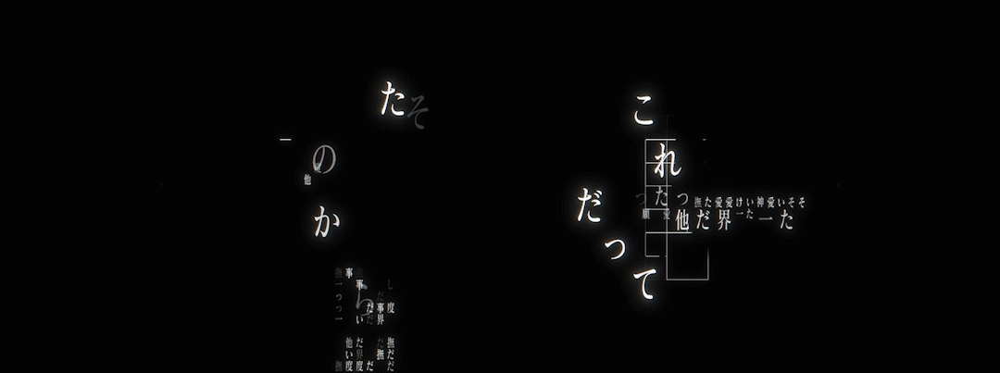

  

<h1 align="center">Arthur 👋</h1>

  

<h2 align="center">🛠️ Tecnologias</h2>

  

  

<h1 align="center">Olá 👋</h1>

  Desenvolvedor aprendendo Lua, JavaScript, Node.js e desenvolvimento de jogos.

---

## 👨‍💻 Sobre mim

* 🎮 Desenvolvendo jogos e sistemas no **Roblox Studio**
* 🌙 Aprendendo **Lua**
* 🌐 Aprendendo **JavaScript, Node.js, HTML e CSS**
* 🐍 Também mexendo com **Python**
* 💻 Gosto de criar projetos, testar ideias e entender como as coisas funcionam

---

## 🚀 Projetos

### 📞 VibeCall

Aplicativo de chamadas com chat, perfis, grupos e compartilhamento de tela.

`JavaScript` `Node.js` `Electron` `WebRTC` `WebSocket`

### ⚔️ Sword Fight

Jogo de combate com espadas feito no Roblox, com leaderboards, killstreaks e outros sistemas.

`Lua` `Roblox Studio`

### 🛍️ Roblox Catalog

Sistema de catálogo para Roblox com interface, pesquisa e visualização de itens.

`Lua` `Roblox Studio`

---

  <i>Sempre aprendendo e criando coisas novas 🚀</i>

<h2 align="center">🐍 Minhas contribuições</h2>

  <picture>
    <source media="(prefers-color-scheme: dark)" srcset="https://raw.githubusercontent.com/gd9u/gd9u/output/github-contribution-grid-snake-dark.svg">
    <source media="(prefers-color-scheme: light)" srcset="https://raw.githubusercontent.com/gd9u/gd9u/output/github-contribution-grid-snake.svg">
    
  </picture>

